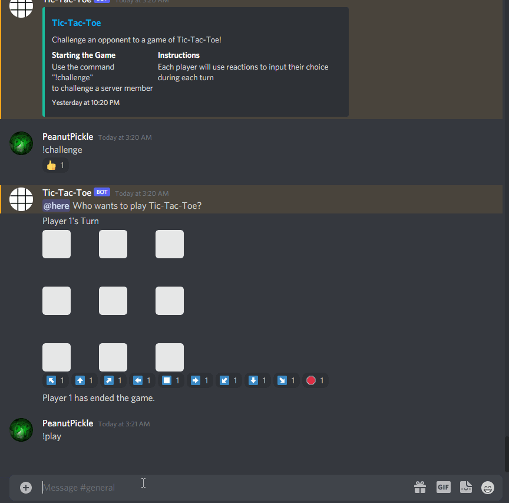

# TicTacToe-Discord-Bot

**TicTacToe-Discord-Bot** is a game bot that is able to be added to any Discord server while the bot code is  being run in which 2 players (or 1 versing one's self) are able to challenge each 
other in a game of Tic-Tac Toe. 

The bot was coded in Python by implementing the discord.py library.

Submitted by: **Dylan Boyza**

Time spent: around **10** hours spent in total

## Video Walkthrough

Here's a walkthrough:

GIF created with [LiceCap](http://www.cockos.com/licecap/).

## Notes

This is the first non-trivial project that I created in Python. I learned a lot about the syntax and how the language works in general. 
